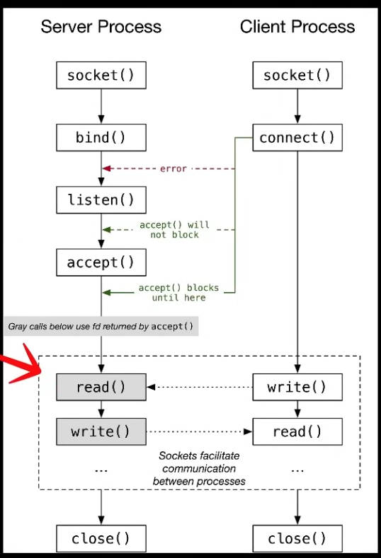

## Contents
- [Sockets](#sockets)
  - [Socket type](#socket-type)
- [socket fd states](#socket-fd-states)
- [POLL](#poll)
- [HTTP](#http)

# **Sockets**
Sockets are an abstraction provided by the OS to enable communication between different processes either on the same machine or over a network. They act as endpoints in a two-way communication channel. So that when two machines or two apps need to communicate to each others other the internet or a local network, each side of that communication will create a socket.

typical flow:

## **Socket type**
### Datagram (SOCK_DGRAM)
In Internet Protocol terminology, the basic unit of data transfer is a datagram.
It's the D in UDP
### Stream (SOCK_STREAM)
This type of socket is connection-oriented. Establish an end-to-end connection by using the bind(), listen(), accept(), and connect() APIs. SOCK_STREAM sends data without errors or duplication, and receives the data in the sending order.
### Raw (SOCK_RAW)
raaw

# **socket fd states**:

| State         | How you get there   | What you can do                                   |
|---------------|---------------------|---------------------------------------------------|
| **Unbound**   | `socket()`          | `bind`, `connect`, `close`                        |
| **Bound**     | `bind()` on unbound | `listen` (server) or `connect` (rare for clients) |
| **Listening** | `listen()` on bound | `accept`, `close` — never `recv`/`send`           |
| **Connected** | `accept()` (server) or `connect()` (client) | `recv`, `send`, `shutdown`, `close` |
| **Shut down (one side)** | `shutdown(fd, SHUT_RD/WR)` | Other direction still works     |
| **Closed**    | `close()`           | fd is gone                                        |

---

**`int socket(int __domain, int __type, int __protocol)`**  
    creates a socket fd (for communication). A socker fd is a fd plus a 5-tuple of state the kernel maintains: (protocol, local IP, local port, remote IP, remote port). Reachable from other processes, other machines, the internet.  
    domain: IPv4  
    type: stream (TCP)  
    protocol: 0 (for some type/domain combinaison, protocol allows us to select between several protocols)  

**`int bind(int __fd, const sockaddr *__addr, socklen_t __len)`**  
    bind the socket fd to an address (IPv4 + port)  
    `sockaddr *__addr`: sockaddr is a struct to define the address+port;  
        we use the `sockaddr_in` struct (which is more specific, for internet socket address) and upcast it as `sockaddr`.  
        `addr.sin_port = htons(8080);` hton = host to network, networks are always big endians, host to network convert the bytes (usually its small endians on CPUs but not always)  
        `addr.sin_addr.s_addr = htonl(INADDR_ANY);` INADDR_ANY = 0  

**`int listen(int __fd, int __n)`**
    marks the socket as passive, "this socket's role is to receive incoming connexions, not to initiate them".  
    allocates the accept queue.  
    -> creates a **listening** socket  

**`int accept(int __fd, sockaddr *__restrict__ __addr, socklen_t *__restrict__ __addr_len)`**
    takes a socket fd and wait for something to connect to it  
    when a connexion arrives, open a new (client/read) socket to communicate with it.  
    ADDR is set to the address and ADD_LEN set to the length  
    returns a new **connected** socket  

---

**Listening socket (from socket() + bind() + listen())**:

Its only job is to wait for incoming connection requests.
You never recv/send data on it. Doing so would error out.
The only thing you do with it is accept(), which pulls the next pending connection off its queue.

**Connection socket (returned by accept())**:

A full-bidirectionnal channel between server and client. You can recv and send on the same fd.

# **POLL**

Poll is what allows you to have a lots of fds, you put them in a poll, only when one has a change
does poll() reacts and allows you to keep going.

select, poll, epoll, allows to create a poll of sockets where you handle the ones that are ready.

poll.revents is a bitmask, the main values to care about:

* POLLIN: Ready to read
* POLLOUT: Writing wont block

* POLLHUP: _Hang up_ Peer closed cleaned, end of conversation
_FAILURES_
* POLLERR: _Error_
* POLLNVAL: _Invalidm_ the fd in the `pollfd` struct is not valid fd. (almost always a bug in the code, not a network event)

epoll vs poll
These event notification mechanisms drastically reduce CPU usage and latency by avoiding idle waiting or redundant polling.

**fcntl(fd, F_SETFL, O_NONBLOCK);**
_What "blocking" means:_

A syscall is blocking when it puts your thread to sleep until the operation can complete. The OS suspends your process; the CPU runs other things; you wake up when the kernel has something for you.

For each socket call, "nothing to do" looks different:

* `accept()` blocks when the listen queue is empty (no client is connecting).
* `recv()` blocks when the receive buffer is empty (peer hasn't sent anything).
* `send()` blocks when the kernel's send buffer is full (peer isn't draining fast enough).

A non-blocking fd: instead of sleeping, the syscall returns -1 immediately and sets errno to EAGAIN/EWOULDBLOCK. The thread keeps running.

# HTTP

## \r\n vs \n
CRLF means Carriage Return + Line Feed.

In the HTTP/1.1 protocol, all header fields except Host are optional. 
A request line containing only the path name is accepted by servers to maintain compatibility with HTTP clients before the HTTP/1.0 specification in RFC 1945.

 A general-purpose web server is required to implement at least GET and HEAD, and all other methods are considered optional by the specification.[18]: §9.1 

Method names are case sensitive.[4]: §3 [18]: §9.1  This is in contrast to HTTP header field names which are case-insensitive.[18]: §6.3  

**Don't trim the key**. Per RFC 7230 §3.2.4, whitespace between the field name and the colon is forbidden (Host : example.com ← invalid). You should reject it with 400, not silently strip it. The grammar is field-name ":" OWS field-value OWS — leading/trailing OWS only applies to the value side.

**Header names are case-insensitive (Host == host == HOST).** You typically normalize to lowercase when storing in the map so lookups are consistent:

414 URI Too Long — request line (specifically the URI) exceeds the limit
431 Request Header Fields Too Large — a header line or total headers exceed
400 Bad Request — generic fallback